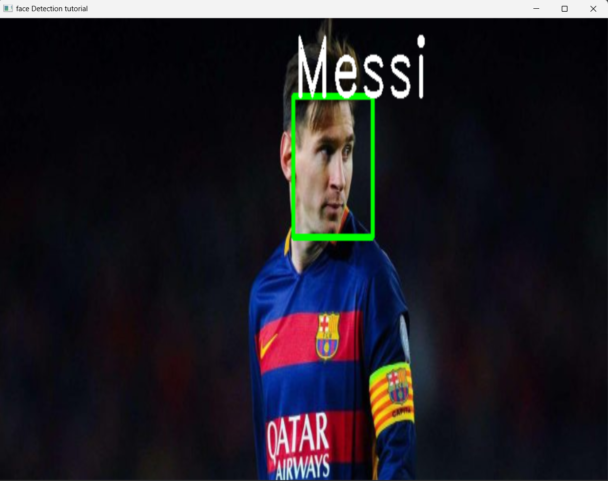

**<u>Real-time Face Recognition and Detection</u>**

This project presents a real-time face recognition and detection system that can accurately identify and classify individuals in real-time video feeds. It has been trained on a dataset containing images of two iconic football players: Messi and Ronaldo.

Key Features

The project includes the following key components:

 Training Images: A curated dataset of images featuring Messi and Ronaldo for training purposes. 
 Resizing and Preprocessing: Images undergo preprocessing steps to optimize them for efficient processing. 
 Tester Python File: A Python script is provided to test the face recognition model on random images. 
 Videotesting Python File: This Python script enables real-time player detection in video streams. 

**<u>Tester.py Results</u>**

  
  

.

**<u>VideoTester.py Results</u>**

  
  

